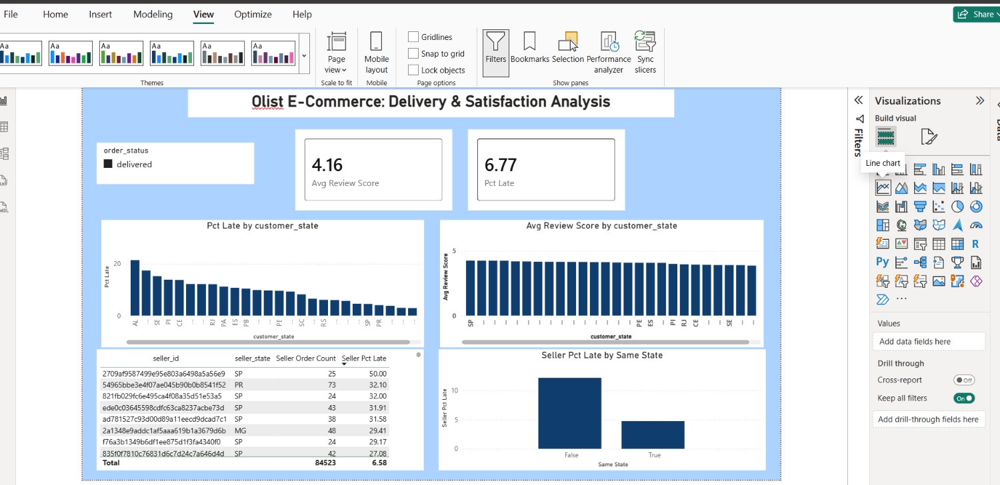

# Olist E-Commerce: Delivery & Customer Satisfaction Analysis

Business analytics project analyzing 99,000+ orders from Olist, a Brazilian
e-commerce marketplace, to identify the root cause of inconsistent customer
satisfaction.

## Business problem
Olist had inconsistent customer review scores across orders, with no clear
diagnosis of the underlying cause — delivery issues, seller quality, or
product category were all possible explanations.

## Approach
- Imported and joined 8 relational tables (orders, items, payments, reviews,
  customers, sellers, products, category translation) in Power BI
- Cleaned data: removed 814 duplicate review records, resolved order/product
  join integrity issues, filtered to delivered orders only
- Built DAX measures for delivery delay, late-delivery rate, and average
  review score
- Tested three hypotheses in sequence: product category, seller quality, and
  shipping distance

## Key findings
- Late deliveries drop average review scores from **4.29 to 2.27 out of 5**
- The states with the worst reviews (RJ, BA) are **not** driven by bad local
  sellers — the worst-performing sellers are mostly based in São Paulo
- The real driver is **interstate shipping distance**: interstate orders to
  RJ/BA are late **2.5x more often** than same-state orders

## Recommendation
Focus logistics improvement on interstate carrier routes into RJ, BA, and ES
rather than auditing individual sellers or product categories.

## Dashboard

## Files
- [Full insight report](Olist_Insight_Report.docx) — detailed findings and
  recommendations
- Dashboard built in Power BI (Power Query for cleaning, DAX for KPIs)

## Tools
Power BI (Power Query, DAX), Excel

## Dataset
[Olist Brazilian E-Commerce Public Dataset](https://www.kaggle.com/datasets/olistbr/brazilian-ecommerce) (Kaggle)
